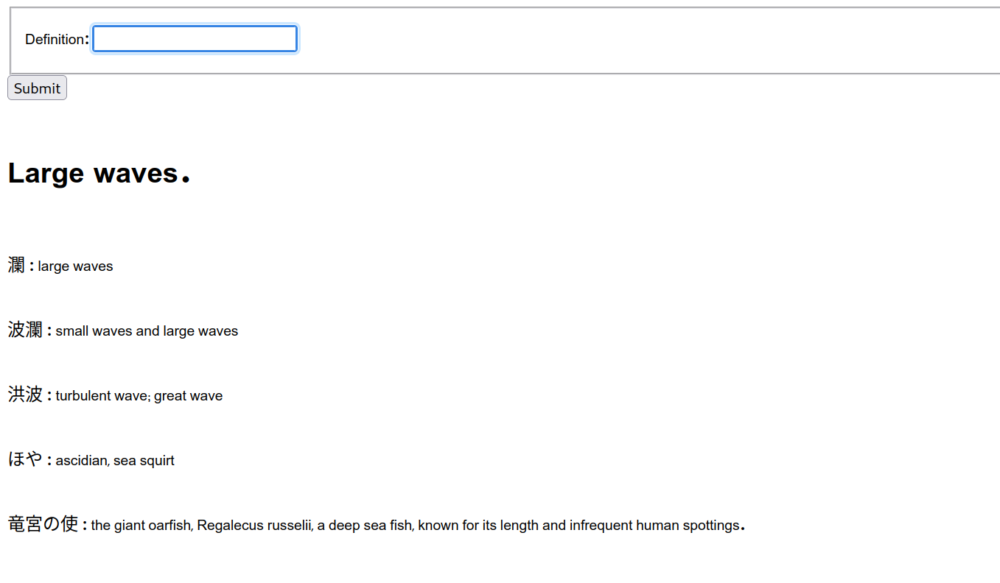
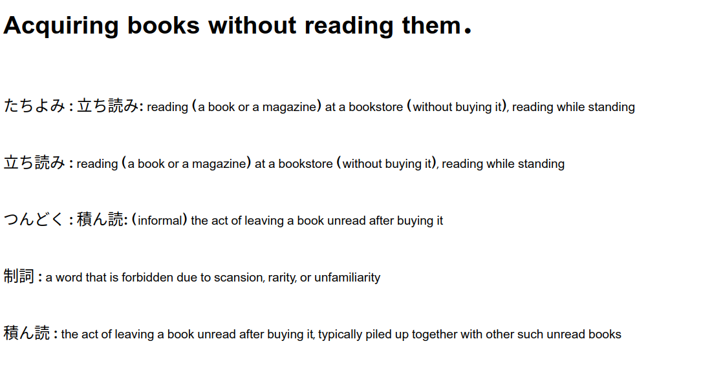

Performs semantic search using a BERT Sentence Encoder and Postgres + PgVector to encode semantic meaning of wiktionary word senses,then finding the closest English word to user defined definitions.

As Japanese has some famous examples of "untranslatable" words, my first implemention was with Japanese occurences on English wiktionary, but it simply scales to any other language (and hopefully all of them):

\

\

Romanization, just for completeness:

tachiyomi, tachiyomi, tsundoki, seishi, tsundoku

ōnami, kōtō, kōha, hatō, nami

Contains basic implementation of an LLM webapp, locally hosting the Postgres database and a Django backend, with the website communicating a local TorchServe instance of the model. 

English wiktionary data provided in JSON format by Kaikki.org, a project run by Tatu Ylonen.

https://huggingface.co/sentence-transformers/msmarco-distilbert-base-v3 

https://kaikki.org/ 

https://github.com/tatuylonen/wiktextract 
